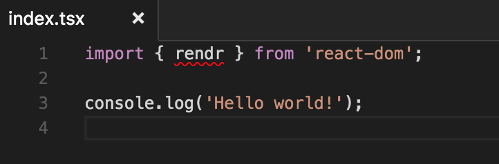
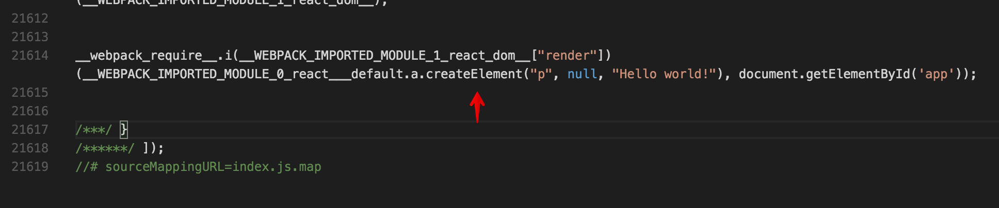

# React with TypeScript

> Small examples which show how React can be used with TypeScript.

React and TypeScript are awesome technologies. Getting started with both of them can be difficult however. Here are very small examples to make adopting both technologies easier.

Note that this is neiter a React tutorial nor a TypeScript tutorial. I want explain these technologies in depth. I just show you how they can be used together. We'll also use a little bit of WebPack, but again I will not explain WebPack in detail here.

# Table of contents

0. [Setup](#setup)
0. [React](#react)
0. [Stateless Functional Components](#stateless-functional-components)
  0. [without props](#without-props)
  0. [with props](#with-props)
  0. [reusing props](#reusing-props)
0. [Stateful Class Components](#stateful-class-components)

## Setup

Create a basic `package.json` like this:

```json
{
  "name": "react-with-typescript",
  "version": "1.0.0",
  "private": true
}
```

Install our dependencies like this:

```bash
$ npm install --save-dev typescript wepack@beta awesome-typescript-loader
```

We need TypeScript for compiling our TypeScript files to JavaScript (surprising, right?) and we need `webpack@beta` and `awesome-typescript-loader` to _bundle_ our compiled JavaScript files. The last step is needed because TypeScript makes no assumptions about how your compiled JavaScript files are loaded. E.g. if you'd write a Node project based on TypeScript you could just `require` your compiled JavaScript files - no bundling needed. But we want to use React in a browser project. Our browser has no `require` function and I don't want to add a module loader framework here, so we just bundle our files for now.

Now we create a `tsconfig.json` to configure TypeScript:

```json
{
  "compilerOptions": {
    "allowSyntheticDefaultImports": true,
    "experimentalDecorators": true,
    "jsx": "react",
    "module": "es2015",
    "moduleResolution": "node",
    "noImplicitAny": true,
    "noImplicitReturns": true,
    "noImplicitThis": true,
    "strictNullChecks": false,
    "target": "es5"
  }
}
```

// **TODO**: Explain `tsconfig.json` settings.

And create a `webpack.config.js`:

```javascript
const join = require('path').join;

module.exports = {
  entry: './src/index.tsx',
  output: {
    filename: 'index.js',
    path: join(process.cwd(), 'dist')
  },
  resolve: {
    extensions: [ '.ts', '.tsx', '.js', '.jsx' ]
  },
  devtool: 'source-map',
  module: {
    loaders: [
      {
        test: /\.ts(x?)$/,
        loader: 'awesome-typescript-loader'
      }
    ]
  }
};

```

// **TODO**: Explain `webpack.config.js` settings.

Create an example TypeScript file in `src/index.tsx`:

```typescript
console.log('Hello world!');
```

Add the following `script` to your `package.json`:

```diff
{
  "name": "react-with-typescript",
  "version": "1.0.0",
  "private": true,
+  "scripts": {
+    "build": "webpack"
+  },
  "devDependencies": {
    "awesome-typescript-loader": "^2.2.4",
    "typescript": "^2.0.3",
    "webpack": "^2.1.0-beta.25"
  }
}
```

If you run `$ npm run -s build` in your terminal you'll get an output like this one:

```bash
$ npm run -s build
Hash: e8d28b20ce26c4d5681e
Version: webpack 2.1.0-beta.25
Time: 1126ms
       Asset     Size  Chunks             Chunk Names
    index.js   2.8 kB       0  [emitted]  main
index.js.map  2.88 kB       0  [emitted]  main
    + 2 hidden modules
```

In your `dist/` directory should be two files: `index.js` and `index.js.map`. The first one is your TypeScript file compiled to a JavaScript _and_ bundled with WebPack (even if we haven't used more than one file for now.) The last one is a Source Map file. It helps the browser to map stack traces from the JavaScript file to the original TypeScript file.

We should add a simple server now to test our file in the browser. We use a really basic static file server - no fancy live reloading to keep the setup as small as possible.

```bash
$ npm install --save-dev http-server
```

By default it will serve files from your current working directory. Let's add a simple `index.html`:

```html
<!DOCTYPE html>
<head>
  <meta charset="UTF-8">
  <title>React with TypeScript</title>
</head>
<body>
  <script src="dist/index.js"></script>
</body>
</html>
```

Note that we import our bundled JavaScript file in a `<script/>` tag.

As the last step modify our `package.json` like this:

```diff
{
  "name": "react-with-typescript",
  "version": "1.0.0",
  "private": true,
  "scripts": {
-    "build": "webpack"
+    "build": "webpack",
+    "serve": " http-server -s"
  },
  "devDependencies": {
    "awesome-typescript-loader": "^2.2.4",
    "typescript": "^2.0.3",
    "webpack": "^2.1.0-beta.25"
  }
}
```

Let's test our "application".

```bash
$ npm run -s build
$ npm run -s serve
```

Open your browser and visit `http://localhost:8080/`. Open your dev tools. You should see `Hello world!` somewhere and if your browser supports Source Maps you should see something like `index.tsx:1`  behind it - or something like `index.js:73`, if your browser doesn't support Source Maps.

Every time you make changes to your TypeScript files just call `$ npm run -s build` and reload the browser to see the changes.

## React

Now we want to render a very basic React application. Install React and all other dependencies we need.

```bash
$ npm install --save react react-dom @types/react @types/react-dom
```

You should know `react` and `react-dom`, but what is `@types/react` and `@types/react-dom`? React is not developed with TypeScript. For TypeScript it is a plain "JavaScript project" without any typing information. Libraries which aren't written with TypeScript can get typing information through additional declaration files though. They can be either included in the library itself or installed seperately. The [DefinitelyTyped](https://github.com/DefinitelyTyped/DefinitelyTyped) project collects typing declaration files (also called `.d.ts` files) for libraries which have no typing information included and published them into the `@types` scope. The TypeScript compiler automatically reads these declarations so it now knows about the exported objects, classes, functions and so on of the given libraries.

Let's try it. Open your `src/index.tsx` and write this:

```diff
+import { rendr } from 'react-dom';

console.log('Hello world!');
```

If you use a modern IDE like WebStorm or VS Code it should already tell you, that `rendr` isn't exported by `react-dom`. It could look like this:



You can get a similar error, if you try to build the project `$ npm run -s build`:

```bash
$ npm run -s build
Hash: 08526655bdf71ff14490
Version: webpack 2.1.0-beta.25
Time: 1507ms
       Asset     Size  Chunks             Chunk Names
    index.js  2.65 kB       0  [emitted]  main
index.js.map  2.73 kB       0  [emitted]  main
    + 1 hidden modules

ERROR in [default] /Users/donaldpipowitch/Workspace/react-with-typescript/src/index.tsx:1:9
Module '"/Users/donaldpipowitch/Workspace/react-with-typescript/node_modules/@types/react-dom/index"' has no exported member 'rendr'.
```

Note the last line!

Let's rewrite our example so we have a working application.

```diff
+import React from 'react';
+import { render } from 'react-dom';
-import { rendr } from 'react-dom';

+render(<p>Hello world!</p>, document.getElementById('app'));
-console.log('Hello world!');
```

Why do we import `React`, if it isn't used anywhere? Because we use JSX syntax! And as you hopefully know JSX is transpiled to something like this:

```diff
-<p>Hello world!</p>
+React.createElement('p', null, 'Hello world!')
```

You can even search for it in your `dist/index.js` after building the application:



On last step to actually see something: We try to get an element with the id `app`, but there is no element with that id in our `index.html`. We should add one:

```diff
<!DOCTYPE html>
<head>
  <meta charset="UTF-8">
  <title>React with TypeScript</title>
</head>
<body>
+  <div id="app">Loading...</div>
  <script src="dist/index.js"></script>
</body>
</html>
```

Nice. Now build your app and refresh the browser. You should briefly see the paragraph _"Loading..."_ and after that _"Hello world!"_ in your browser.

## Stateless Functional Components

### without props

Now we'll create a basic stateless function component. Create a new file called `src/sfc.tsx`:

```typescript
import React from 'react';

export const ExampleStatelessComponent = () => <p>Hello world!</p>;
```

And change `src/index.tsx`:

```diff
import React from 'react';
import { render } from 'react-dom';
+import { ExampleStatelessComponent } from './sfc'

-render(<p>Hello world!</p>, document.getElementById('app'));
+render(<ExampleStatelessComponent />, document.getElementById('app'));
```

This works fine. You can test the app, if you want. TypeScript infers the type of `ExampleStatelessComponent` as `() => JSX.Element`.

We _could_ be a little bit more expressive, if we want. Say someone accidentally like this:

```diff
import React from 'react';

-export const ExampleStatelessComponent = () => <p>Hello world!</p>;
+export const ExampleStatelessComponent = () => 'Hello world!';
```

An error will be thrown in your `src/index.tsx`, because `render` doesn't want a function which returns a string, but it could be nice to see this error inside `src/sfc.tsx`. To be more explicit we can rewrite our example like this:

```diff
-import React from 'react';
+import React, { SFC } from 'react';

-export const ExampleStatelessComponent = () => <p>Hello world!</p>;
+export const ExampleStatelessComponent: SFC<void> = () => 'Hello world!';
```

Now we say `ExampleStatelessComponent` should be a stateless functional component (`SFC`) which accepts no props (`<void>`). This throws an error now inside `src/sfc.tsx`. So let us fix the error.

```diff
import React, { SFC } from 'react';

-export const ExampleStatelessComponent: SFC<void> = () => 'Hello world!';
+export const ExampleStatelessComponent: SFC<void> = () => <p>Hello world!</p>;
```

### with props

Now let us write a new stateless functional component which accepts a value as props.

```diff
import React, { SFC } from 'react';

export const ExampleStatelessComponent: SFC<void> = () => <p>Hello world!</p>;

+export const ExampleStatelessValueComponent: SFC<{ value: string }> = (props) => <p>Hello {props.value}!</p>;
```

You could rewrite this with destructing:

```diff
-export const ExampleStatelessValueComponent: SFC<{ value: string }> = (props) => <p>Hello {props.value}!</p>;
+export const ExampleStatelessValueComponent: SFC<{ value: string }> = ({ value }) => <p>Hello {value}!</p>;
```

And with declarating the props interface seperately:

```diff
-export const ExampleStatelessValueComponent: SFC<{ value: string }> = ({ value }) => <p>Hello {value}!</p>;

+interface ExampleStatelessValueProps {
+  value: string;
+}
+export const ExampleStatelessValueComponent: SFC<ExampleStatelessValueProps> = ({ value }) => <p>Hello {value}!</p>;
```

It is a matter of taste.

Let us use our new component inside `src/index.tsx`:

```diff
import React from 'react';
import { render } from 'react-dom';
-import { ExampleStatelessComponent } from './sfc'
+import { ExampleStatelessComponent, ExampleStatelessValueComponent } from './sfc'

-render(<ExampleStatelessComponent />, document.getElementById('app'));
+render(
+  <div>
+    <ExampleStatelessComponent />
+    <ExampleStatelessValueComponent value="donaldpipowitch" />
+  </div>,
+  document.getElementById('app')
+);
```

Note that if you would write `<ExampleStatelessValueComponent value2="donaldpipowitch" />` or `<ExampleStatelessValueComponent value={1} />` TypeScript would always throw an error, because the interface of the props for `ExampleStatelessValueComponent` is wrong.

### reusing props

Let us create an `<Input />` component which automatically sets `type` to `text`, but could be overwritten if needed.

```diff
-import React, { SFC } from 'react';
+import React, { SFC, HTMLAttributes } from 'react';

export const ExampleStatelessComponent: SFC<void> = () => <p>Hello world!</p>;

interface ExampleStatelessValueProps {
  value: string;
}
export const ExampleStatelessValueComponent: SFC<ExampleStatelessValueProps> = ({ value }) => <p>Hello {value}!</p>;

+export const Input: SFC<HTMLAttributes<HTMLInputElement>> = (props) => <input type="text" {...props}/>;
```

Here we say that `<Input />` is a `SFC` which accepts the same values as a normal `<input />` (`<HTMLAttributes<HTMLInputElement>>`). We automatically set `type="text"` and pass all additional props to `<input />` with `{...props}`. That way we could overwrite `type`.

We can also set props which _can't_ be overwritten by changing the order of the props. Let us create a `<Button />` which is allways the `type` of `button`.

```diff
import React, { SFC, HTMLAttributes } from 'react';

export const ExampleStatelessComponent: SFC<void> = () => <p>Hello world!</p>;

interface ExampleStatelessValueProps {
  value: string;
}
export const ExampleStatelessValueComponent: SFC<ExampleStatelessValueProps> = ({ value }) => <p>Hello {value}!</p>;

export const Input: SFC<HTMLAttributes<HTMLInputElement>> = (props) => <input type="text" {...props}/>;
+export const Button: SFC<HTMLAttributes<HTMLButtonElement>> = (props) => <button {...props} type="button"/>;
```

Add our new componenents to `src/index.tsx`:

```diff
import React from 'react';
import { render } from 'react-dom';
-import { ExampleStatelessComponent, ExampleStatelessValueComponent } from './sfc';
+import {
+  ExampleStatelessComponent,
+  ExampleStatelessValueComponent,
+  Input,
+  Button
+} from './sfc';

render(
  <div>
    <ExampleStatelessComponent />
    <ExampleStatelessValueComponent value="donaldpipowitch" />
+    <Input type="number" />
+    <Button type="submit">Test</Button>
  </div>,
  document.getElementById('app')
);
```

If you build the app and refresh the browser you should see in the DOM inspector a `<input type="number/>` and a `<button type="button">Test</button>`.

Could we tell TypeScript that `<Button type="submit">` is _invalid_ in the sense of _it will have no effect and works different than you expect_? Sure.

```diff
import React, { SFC, HTMLAttributes } from 'react';

export const ExampleStatelessComponent: SFC<void> = () => <p>Hello world!</p>;

interface ExampleStatelessValueProps {
  value: string;
}
export const ExampleStatelessValueComponent: SFC<ExampleStatelessValueProps> = ({ value }) => <p>Hello {value}!</p>;

export const Input: SFC<HTMLAttributes<HTMLInputElement>> = (props) => <input type="text" {...props}/>;

-export const Button: SFC<HTMLAttributes<HTMLButtonElement>> = (props) => <button {...props} type="button"/>;
+interface ButtonsProps extends HTMLAttributes<HTMLButtonElement> {
+  type?: 'button';
+}
+export const Button: SFC<ButtonsProps> = (props) => <button {...props} type="button"/>;
```

We just create a new interface called `ButtonsProps` which extends `HTMLAttributes<HTMLButtonElement>` and we tell it that you _can_ (see the `?` behind `type`) have a `type`, but that only `'button'` is valid. Now we need to fix our `src/index.tsx`:

```diff
import React from 'react';
import { render } from 'react-dom';
import {
  ExampleStatelessComponent,
  ExampleStatelessValueComponent,
  Input,
  Button
} from './sfc';

render(
  <div>
    <ExampleStatelessComponent />
    <ExampleStatelessValueComponent value="donaldpipowitch" />
    <Input type="number" />
-    <Button type="submit">Test</Button>
+    <Button>Test</Button>
  </div>,
  document.getElementById('app')
);
```

Such non-standard behavior should be documented! It turns out TypeScript is really good at helping you with that.

```diff
import React, { SFC, HTMLAttributes } from 'react';

export const ExampleStatelessComponent: SFC<void> = () => <p>Hello world!</p>;

interface ExampleStatelessValueProps {
  value: string;
}
export const ExampleStatelessValueComponent: SFC<ExampleStatelessValueProps> = ({ value }) => <p>Hello {value}!</p>;

export const Input: SFC<HTMLAttributes<HTMLInputElement>> = (props) => <input type="text" {...props}/>;

interface ButtonsProps extends HTMLAttributes<HTMLButtonElement> {
+  /**
+   * This will allways be `type="button"`. In the future we will have standalone
+   * `<Submit />` and `<Reset />` components for other cases.
+   */
  type?: 'button';
}
export const Button: SFC<ButtonsProps> = (props) => <button {...props} type="button"/>;
```

See how it behaves in VS Code:


If you want MarkDown support in IntelliSense for VS Code please vote for [this issue](https://github.com/Microsoft/vscode/issues/1920).

## Stateful Class Components

// **TODO**
